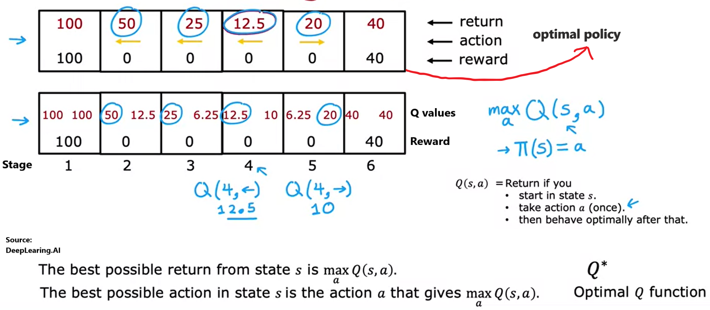
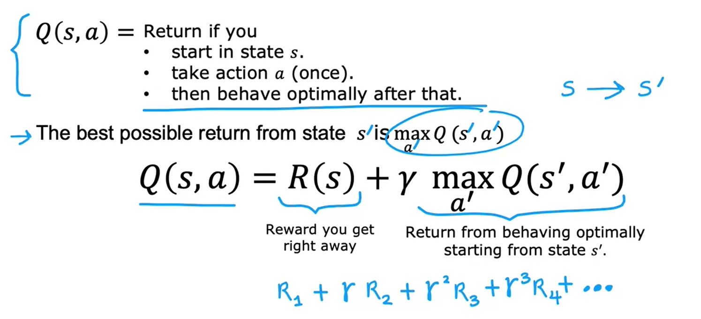
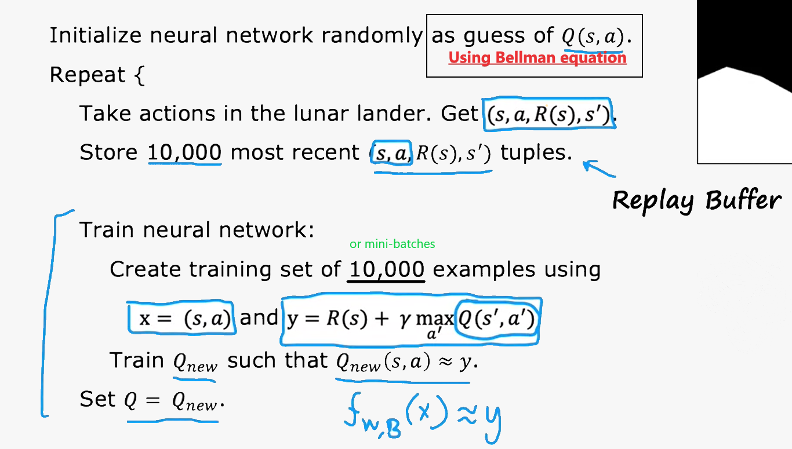
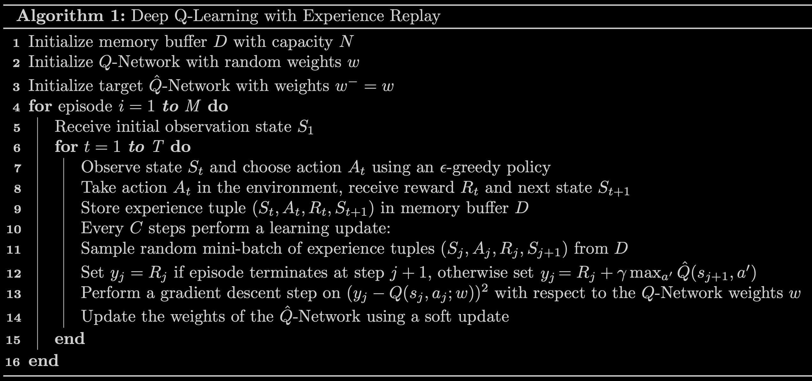

# Reinforcement Learning

___

⚡️ **Work is still in progress**

## Outline 
- [ 1 - Fundamentals ](#1)
  - [1.1 - Concepts and Components](#1.1) 
  - [1.2 - State-action value functions (Q-function)](#1.2) 
  - [1.3 - Continuous state spaces](#1.3) 
- [ 2 - Hands-on projects](#2)
  - [2.1 - Deep Q-Learning for Lunar Lander](#2.1)
  - [2.2 - Human-Level Control Through Deep Reinforcement Learning](#2.2)

## 1 - Fundamentals 

To have an overview about *Reinforcement Learning*, I suggest you learning [*week 3 of "Unsupervised Learning, Recommenders, Reinforcement Learning" part*](https://www.coursera.org/learn/unsupervised-learning-recommenders-reinforcement-learning/home/week/3) in Machine Learing Specialization course, offered by Deeplearning.AI. Some images of this repository are captured in this course. 

#### 1.1 - **Concepts and Components**

> The key distinction between **reinforcement learning (RL)** and **standard deep learning (DL)** is that in standard deep learning the prediction of a trained model on one test datum *<u>does not affect the predictions on a future test datum</u>*; in reinforcement learning decisions at future instants (in RL, decisions are also called actions) are *<u>affected by what decisions were made in the past</u>*. [[Chaper 17. Reinforcement Learning - Dive into Deep Learing book]](https://d2l.ai/chapter_reinforcement-learning/index.html)

\- First, we figure out how many key components and their roles in RL:

+ *`Agent`*: interacts with an *environment* over time.

+ *`Environment`*: represents a problem or a task to be solved. 

+ *`State`*

    + *Notation*: a set of states ($S$), a current state ($s$) and a new state ($s'$)

    + *Terminal state* nothing more happens

> Differences between **a state** and **an observation**: *"The state needs to contain all the information to ensure that the system is Markovian; meaning that given the current state, you have perfect information about the probability distribution of all possible future states, dependent on the actions taken. The observation function does not have any such strict restrictions. It can be any stochastic function dependent on the state".* [[Answered by Robby Goetschalckx in Quora]](https://www.quora.com/What-is-the-difference-between-an-observation-and-a-state-in-reinforcement-learning)

+ *`Action`*: at each state $s$, the agent can take an action $a$ in the set of actions $A$.

    + *Notation*: an action ($a$)

+ *`Reward`*:  the *agent* will get a reward $r(s)$ when it takes an action $a$ at state $s$ 

    + *Notation*: a reward $r(s)$ of the action to another state

+ *`Episode`* is a sequence of interactions between the *agent* and *environment* from intial to terminal states.

+ *`The return`*: is the estimate of the total long-term reward of a trajectory. On the other hand, it is sum of rewards the system got, and weighted by the *discount* factor.

    + *Notation*: a return $G_t$ and a discount factor ($\gamma$) that is used in the situation where the sequence of states and actions in a trajectory can be *infinitely long* and *the return of any such infinitely long trajectory will be infinite*.

    + *Discount* value: $\gamma \in (0, 1]$

    + *Formula* (the problem is set up in *discrete* state and action spaces): given a state $S$ at the time $t$
    
    $$G_t = R(\tau) = r_t + r_{(t+1)} \times \gamma + r_{(t+2)} \times \gamma ^ 2 + r_{(t+3)} \times \gamma ^ 3 + ...$$

+ *`Policy`*: <u>is a function mapping states to distribution over actions</u>. At each time step $t$, the agent receives a state $s_t$ in a state space $S$ from the environment and choose an action $a_t$ from an action space $A$, following a policy $\pi (a_t|s_t)$.

    + *Notation*: a function $\pi(s) = a$ tells us what action $a$ to take in a given state $s$.

    + ***The goal of Reinforcement learning*** is to find $\pi$ such that $a = \pi(s)$ and we will know what action $a$ needed to take in every state $s$ to maximize the *return*.

    + We have two kinds of policies: 

      + **Deterministic policy** in the deterministic environment: maps from a state to an action

      + **Stochastic policy** in the stochastic environment: maps from a state to a distribution over actions.

    + Policy methods [[Deep Reinforcement Learning by Yuxi Li]](https://arxiv.org/abs/1810.06339): 

      + **On-policy method:**

        + It evaluates or improves the behaviour (action) policy.

        + Example: SARSA,...

      + **Off policy method:**

        + An agent learns an optimal value function/policy, maybe following an unrelated behaviour (action) policy. For instance, Q-learning attempts to find action values for the optimal policy directly, <u>not necessarily fitting to the policy generating the data</u>, i.e., the policy Q-learning obtains is usually different from the policy that generates the samples.

        + Example: Q-learning,...

+ *`Transition function`*: is denoted as $P(s'|s, a)$. 

\- *`Markov Decision Process (MDP)`*: is a model for how the state of a system evolves as different actions are applied to the system. *It is a discrete time stochastic control process and helps an agent to make a decision at a specific state*. Here is two Markov properties: 
$$MDP: (S, A, r)$$

  + Each state $s_t$ only depends on the previous state $s_{t-1}$ and the transition $P(s_t|s_{t-1}, a)$.

    + **Random (stochastic) environment:** the sequence of different rewards and next state $s'$ is uncertain because we have a probability of going in the wrong direction which do not comply with the policy. 

  + **Memoryless property**: we do not need to remember all previous states to represent the current state => reducing computational complexity and storage.

$$Q^\*(s,a)=ExpectedReturn = Average(r_t + \gamma r_{t+1} + \gamma ^ 2 r_{t+2} + ...) \\\ = E[r_t + \gamma  r_{t+1} + \gamma ^ 2 r_{t+2} + ...]$$

Which is the sum of rewards $r_t$ discounted by $\gamma$ at each timestep $t$, achievable by a policy $\pi=P(a|s)$. 
  + Let’s now consider the situation when the agent starts at a particular state and continues taking actions to result in a **trajectory** $\tau$: 
    $$\tau = (s_0, a_0, r_0, s_1, a_1, r_1,...)$$

\- **Workflow:** In the standard *agent-environment loop* formalism, an agent interacts with the environment in discrete time steps $t$ = 0,1,2,3,.... At each time step $t$, the agent use a policy $\pi$ to select an action $a$ based on its observation of the environment's state $s_t$. The agent receives a numerical reward $r_t$ and on the next time step, moves to a new state $s_{t+1}$. 

\- **NOTE**: some confused terms

  + **The system model** in *model-free* and *model-based* methods: may be *state transition* and *reward*,...

\- **Applications:**

+ Controlling robots

+ Factory optimization

> When the system model is available, we use dynamic programming methods: **policy evaluation** to calculate value/action value function for a policy, **value iteration** and **policy iteration** for <u>finding an optimal policy</u>. When there is no model, we resort to RL methods.

#### 1.2 - **State-action value function (Q-function)**

\- **Definition:**

> A value function is a prediction of the expected, accumulative, discounted, future reward to evaluate the quality of the state or the action-value pair. 

\- **Background knowledge:**

+ The **state value** function is the expected return for following policy $\pi$ from state $s$ and can be formulated as follows:

$$V^{\pi}(s) = E[R_t|s_t=s]$$

  where $R_t = \sum_{k = 0} ^ {\infty} \gamma ^ {k} \times r_{t+k}$. It can decompose into the **Bellman equation** that decomposes the value function into two parts, ***the immediate reward*** plus ***the discounted future values***: 

$$V^{\pi}(s_t) = \sum_{a \in A} \pi(a_t|s_t) \sum_{s_{t+1},r_t} P(s_{t+1}|s_t, a_t)[r_t + \gamma V^{\pi}(s_{t+1})]$$

  where $\pi(a_t|s_t)$ is the probability of taking action $a_t$ given the state $s_t$, $P(s_{t+1}|s_t, a_t)$ is the probability of trasitioning to a new state $s_{t+1}$ after taking action $a_t$ at the state $s_t$, and $\sum_{a \in A} \pi(a|s)=1$. 

+ The **action-state** or $Q$ value function is the expected return for selecting action $a$ in state $s$ and then following policy $\pi$:

$$Q^{\pi} (s, a)= E[R_t | s_t=s, a_t=a]$$

It can decompose into the **Bellman equation** that decomposes the value function into two parts, ***the immediate reward*** plus ***the discounted future values***:

$$Q^{\pi} (s, a) = \sum_{s_{t+1},r_t} P(s_{t+1}|s_t, a_t)[r_t + \gamma \sum_{a'} \pi(s_{t+1}, a_{t+1}) Q^{\pi}(s_{t+1}, a_{t+1})]$$

\- **Q-function:**
+ The goal of $Q-function$ (***off-policy***) is to find the optimal policy to mazimize the reward, given a current state of the agent.

    + Find out the differences between *off-policy* and *on-policy* [here](https://stats.stackexchange.com/questions/184657/what-is-the-difference-between-off-policy-and-on-policy-learning).

+ *Notation*:  $Q(s, a)$

+ A lower $\gamma$ makes rewards from the uncertain far future less important for an agent than the ones in the near future that it can be fairly confident about.

\- **Bellman equation:** sequence of rewards after you take an action $a$ at the state $s$.

On the other hand, as we know that RL is a stochastic process, Q-values will be different at the time before and after. The disparity is called ***Temporal Difference*** (TD):

$$TD(a, s) = r(s,a) + \gamma \max_{a'}Q(s', a') - Q_{t-1}(s,a)$$

We can get a new Q-value using this equation: 

$$Q_t(s, a) = Q_{t-1}(s,a) + \alpha TD_t (a,s)$$

\- Besides, we also have a definition related to $V^{\pi}(s)$ - is the **state value function** of an MDP. It is the expected return starting from state $s$ following policy $\pi$. $$V^{\pi}(s)=E_{\pi} \{ G_t | s_t = s \}$$

where $G_t$ is the total discounted reward from time step $t$.  

We can see a relationship between the expected return starting from state $s$, taking action $a$ - $Q^{\pi}(s,a)$  and $V^{\pi}(s)$: 

$$V^{\pi}(s) = \sum_{a \in A} \pi(a|s) \times Q^{\pi}(s,a)$$

where $\pi(a|s)$ is the probability of taking the action $a$ at the state $s$ and $A$ is the set of actions.

#### 1.3 - **Continuous state spaces** 

\- With **Q-learning** we havea lookup table $Q(s,a)$ where:

  + Input: a pair of ($s, a$) - X

  + Output: $Q(s, a)$  - y

\- Besides, using *Deep RL* with a training dataset created by *Bellman equation*:

  + Input: a set of states- X

  + Output: Q-values of actions  - y

+ **Deep Q-Network (DQN)** algorithm: 

  + is used to approximate the action-value function ${Q(s,a)}$ $\approx$ $Q^\*(s,a)$ or minimize the mean-squared error between them in the case of <u>the state space is continuous</u> (i.e., we cannot explore the entire state-action space and it is impossible to gradually update $Q(s,a)$ to $Q^\*(s,a)$ ). 

  + Loss function: $$TD^2 (a,s)$$

  + uses a neural network to train a model to predict Q functions, named ***target values***, where guessing of $Q(s,a)$ constructed using Bellman equation as follows

$$
Q(s,a) = r + \gamma \max_{a'}Q(s',a')
$$

\- **$\epsilon$-greedy policy**: is to choose best actions while still learning. For instance, in some state $s$

+ *Option 1*: we pick the action $a$ that maximizes $Q(s, a)$. 

+ *Option 2*: called **$\epsilon$-greedy policy**

  + With probability of $1 - \epsilon$, we pick the action $a$ that maximizes $Q(s, a)$, named ***Greedy*** or ***Expoitation***. 

  + With probability of $\epsilon$, we pick the action $a$ <u>randomly</u> that maximizes $Q(s, a)$, named ***Exploration***. 

+ **NOTE**: at the beginning, we start with $\epsilon$ high and gradually decrease it. 

\- **Algorithm refinements**: *mini-batch* and *soft updates*

+ *Mini-batch learning or gradient descend*: if we have a large dataset, we need to divide our dataset into a number of smaller batches where parameters are updated each batch in stead of the entire dataset (*Batch learning*). 

+ *Soft updates*: make changes from the new value $Q$ to the old value $Q$ not too oscillating and unstable in the case of $Q$ new is worst than $Q$ old. For example, with $\theta \ll 1$, 

$$
\begin{split}
W_{current} = \theta W_{new} + (1 - \theta)W_{current} \\
b_{current} = \theta b_{new} + (1 - \theta) b_{current}
\end{split}
$$

## 2 - Hands-on projects 

#### [2.1 - Deep Q-Learning for Lunar Lander created by DeepLearning.AI](./src/Deep-Q-Network_Lunar_Lander.ipynb)

\- In this work, you should do the lab in the environment offered by Machine Learning Specialization course, Coursera. 

\- **Highlight:** in this lab we will learn how to implement *Deep Q-Learning* algorithm with two techniques, called ***target network*** and ***experience replay*** to avoid instabilities when using neural networks in reinforcement learning to estimate action-value functions or $Q(s, a)$.

#### [2.2 - Train a Deep Q-Learning (DQN) agent on the CartPole-v1 task]()

\- In this lab, we will train a policy that tries to maximize the *return* $r_t$.

\- **Highlights:**

+ We will be using **experience replay memory** for training our DQN. It stores the *transitions that the agent observes*, allowing us to reuse this data later and <u>preventing overfitting because continuous states are often similar or linear</u>. By sampling from it *randomly*, the transitions that build up a batch are decorrelated. It has been shown that this greatly stabilizes and improves the DQN training procedure.
